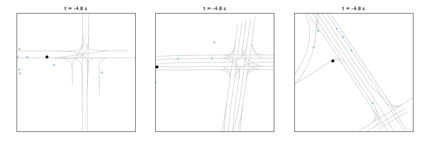
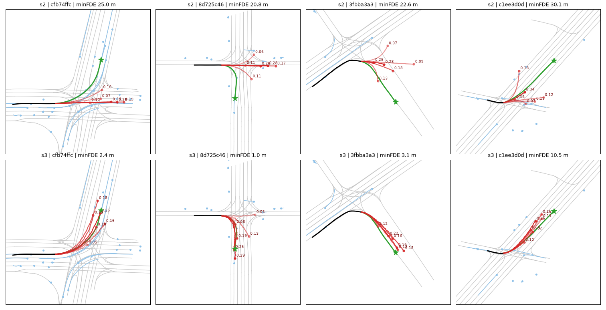
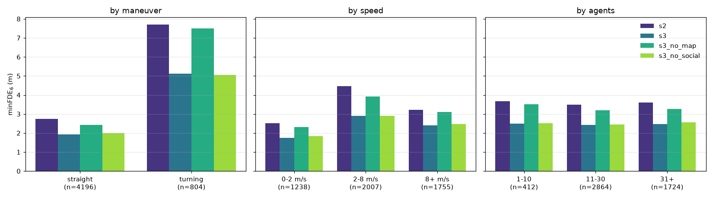
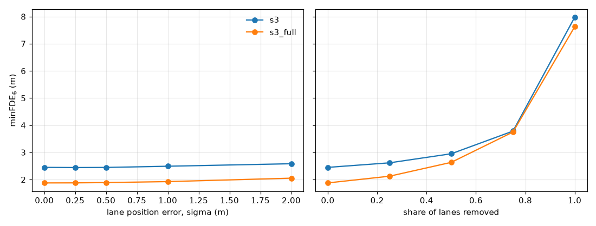

# Trajectory Prediction on Argoverse 2

Predicting where a vehicle will be over the next 6 seconds from 5 seconds of
history, on the [Argoverse 2 Motion Forecasting](https://www.argoverse.org/av2.html)
dataset. Built as a ladder: each stage adds one idea, and every stage is scored
by the same script on the same frozen validation scenarios, so the table shows
what each idea is worth.



*The final model on three turning scenarios chosen by rule, not by eye: the ones
at its median error for turns. Black = 5 s of observed history, red = six
predicted futures with probabilities, green = what actually happened.*



*What the map buys. Top: six predicted futures (red, labelled with probability) from a model that
sees only the car's own history. Bottom: the same scenes after adding the lane
graph. Black = observed history, green = what actually happened.*

## Results

5,000 validation scenarios. Official AV2 metrics in meters, lower is better.

| Stage | What it adds | K | minADE | minFDE | Miss rate | brier-minFDE |
|---|---|---|---|---|---|---|
| S0 | Constant velocity | 1 | 4.41 | 11.69 | 0.85 | 11.69 |
| S1 | GRU encoder–decoder | 1 | 3.22 | 8.50 | 0.83 | 8.50 |
| S2 | 6 modes, winner-take-all loss | 6 | 1.53 | 3.55 | 0.60 | 4.14 |
| **S3** | **Polyline transformer: map + other agents** | 6 | **1.18** | **2.45** | **0.41** | **3.09** |
| | S3 without the map | 6 | 1.44 | 3.24 | 0.55 | 3.86 |
| | S3 without other agents | 6 | 1.19 | 2.49 | 0.43 | 3.13 |
| **S3-full** | **Same model, all 199,908 training scenarios** | 6 | **0.95** | **1.88** | **0.31** | **2.51** |
| | S3-full, second seed | 6 | 0.92 | 1.83 | 0.29 | 2.46 |
| | S3-full without the map | 6 | 1.15 | 2.52 | 0.43 | 3.13 |
| | S3-full without other agents | 6 | 0.96 | 1.94 | 0.32 | 2.57 |

minFDE = endpoint error of the best of K predictions; miss rate = share of
scenarios where no prediction ends within 2 m; brier-minFDE also penalizes
giving the best prediction a low probability.

On the whole official validation split (24,988 scenarios) S3 scores 2.44 and
S3-full 1.86 minFDE — within 0.02 m of the table, so the 5,000-scenario subset
is representative.

**Read this before quoting the numbers:**
- Every row except S3-full is trained on a **15,000-scenario subset (7.5% of the
  training set)**. All rows are evaluated on a 5,000-scenario subset of official
  val. Both subsets were drawn with seed 42 and are frozen in
  [manifests/](manifests/). These are validation numbers from a small model, not
  leaderboard entries.
- One training run per row, except S3-full (two seeds: 1.88 and 1.83). Treat
  differences below ~0.1 m as noise.
- Checkpoints were picked on the same validation set they are reported on.

## What each stage taught

**S0 → S1: learning helps, a little.** A GRU learns speed profiles that constant
velocity can't (cars that are braking keep braking). But a single prediction
trained by regression converges to the *average* future, and the average of
"turn left" and "go straight" is a path nobody drives. Miss rate barely moves.

**S1 → S2: the biggest win is the output, not the network.** Same encoder, but six
predictions, with only the closest one trained on each example
(winner-take-all), so the modes specialize instead of collapsing onto the mean.
minFDE drops from 8.50 to 3.55 for 40 seconds of training. All six modes stay in
use (each wins 7–26% of scenarios).

**S2 → S3: context.** Agent histories and lane centerlines are both polylines.
Each becomes one token via a small PointNet-style encoder; self-attention over
the tokens mixes them; the focal agent's token feeds the same 6-mode head as S2.
0.92 M parameters.

**Ablations: the map does the work.** Removing the map costs 0.79 m; removing the
other agents costs 0.04 m — indistinguishable from noise here. The map's gain is
concentrated where you'd expect:



On turning scenarios the map is worth 2.4 m; without it, turning error is the
same as S2's. A model can't guess where the road goes. The near-zero effect of
other agents was a surprise; likely explanations (the car's own history already
reflects the traffic around it; 15k scenes are too few to learn rare
interactions) are discussed, not proven, in
[docs/notes/14-analysis.md](docs/notes/14-analysis.md).

**More data beats more architecture.** Training the unchanged S3 on the full
training set (13× more scenarios, ~1.5 h on one RTX 4060) takes minFDE from 2.45
to 1.88 m and miss rate from 0.41 to 0.31. The gain is largest on turns
(5.13 → 3.33 m), which the 15k subset had only ~2,400 examples of. Train and val
loss are still equal at the end, so the model is not yet saturated.

**The ablations hold at full scale, with one refinement.** Repeated on all 200k
scenarios: the map is worth 0.64–0.69 m (2.1 m on turns). Other agents are worth
0.06–0.11 m overall — about the size of the seed-to-seed spread (0.05 m) — but
the effect is where it should be: nothing in scenes with ≤10 agents, +0.13 m in
scenes with 31 or more, against both seeds. So social context does help in dense
traffic; it is just small next to the map, and invisible at 15k scenes.

**Beyond minFDE: imperfect maps and staying on the road.** Two evaluation-only
experiments on S3-full ([notes](docs/notes/16-robustness-deployment.md)):



- *Lane position noise barely matters; missing lanes matter a lot.* Shifting
  every lane by σ = 1 m costs 0.05 m. Removing half the lanes costs 0.75 m, and
  removing all of them gives 7.63 m — far worse than the model trained without a
  map (3.24 m). The model uses the map for topology, not centimeters, but having
  only ever seen perfect maps it has no fallback. Pairing it with perceived
  (incomplete) lanes would need lane-dropout augmentation in training.
- *Fast enough to be uninteresting.* 2.4 ms per scene at batch 1 on an RTX 4060
  (0.5 ms at batch 64), model forward pass only.
- *Predictions stay on the road.* 4.7% of S3-full's predicted endpoints are more
  than 3 m from any lane centerline; for the ground truth itself it's 4.4%
  (driveways, parking lots). For S2, which has no map, it's 21% — a failure that
  minFDE never penalizes, since it only scores the best mode.

**What still fails.** For the subset-trained S3, median endpoint error is 1.7 m,
but the worst 10% of scenarios carry 38% of the total error: turns taken at speed
where all six modes went straight, unexpected stops, and wrong-branch choices at
intersections. Full data shrinks the tail (median 1.3 m) without changing its
character: the worst 10% still carry 35%.
Galleries of the 12 worst scenarios per model are in
[results/figures/](results/figures/).

## Engineering notes

- **Agent-centric frame:** every scene is translated and rotated so the focal car
  sits at the origin facing +x. The model never sees city coordinates.
- **Offline preprocessing** to fixed-format `.npz` bundles, versioned by a config
  hash so a stale cache can't be evaluated by accident.
- **Padding is provably inert:** tests fill padded agents, padded lanes and
  unobserved timesteps with garbage and require identical outputs.
- **Metrics cross-checked** against the official `av2` devkit on random inputs
  (max difference 1.4e-14).
- **Overfit-one-batch gate:** every training run must first memorize 16 scenes,
  or it refuses to start.
- 32 tests; one learning note per stage in [docs/notes/](docs/notes/), including
  the predictions that turned out wrong.

## Reproduce

```bash
# Python 3.12, any OS
python3.12 -m venv .venv
. .venv/bin/activate          # Windows: .venv\Scripts\activate
pip install torch             # Windows+NVIDIA: --index-url https://download.pytorch.org/whl/cu121
pip install -e ".[dev]"

# 1. data: ~20k scenarios, ~5 GB, anonymous download from the public S3 bucket
python scripts/download_subset.py --split val --n 5000
python scripts/download_subset.py --split train --n 15000

# 2. preprocess (~30 s)
python scripts/preprocess.py --split val
python scripts/preprocess.py --split train

# 3. train (S1/S2: under a minute each; S3 variants: ~15 min each on an RTX 4060)
python scripts/train.py --config configs/s1_gru.yaml
python scripts/train.py --config configs/s2_multimodal.yaml
python scripts/train.py --config configs/s3_polyline.yaml
python scripts/train.py --config configs/s3_no_map.yaml
python scripts/train.py --config configs/s3_no_social.yaml

# 4. evaluate -> results/val_metrics.csv
python scripts/evaluate.py --stage s0
python scripts/evaluate.py --config configs/s3_polyline.yaml --save-figs 12   # etc. per config

# 5. error analysis -> results/breakdown.csv + figures
python scripts/analyze_errors.py --compare configs/s2_multimodal.yaml configs/s3_polyline.yaml

# 6. optional: full dataset (~55 GB download, ~1.5 h training)
python scripts/download_subset.py --split train --all
python scripts/download_subset.py --split val --all
python scripts/preprocess.py --split train_full
python scripts/preprocess.py --split val_full
python scripts/train.py --config configs/s3_full.yaml       # also: s3_full_seed2, s3_full_no_map, s3_full_no_social
python scripts/evaluate.py --config configs/s3_full.yaml
python scripts/evaluate.py --config configs/s3_full.yaml --val-split val_full

# 7. robustness, off-lane rate + latency, animation (any trained config works)
python scripts/map_robustness.py --config configs/s3_full.yaml
python scripts/deployment_metrics.py --config configs/s3_full.yaml
python scripts/make_animation.py --config configs/s3_full.yaml

# 8. optional: leaderboard submission file (test split has no public labels)
python scripts/download_subset.py --split test --all
python scripts/preprocess.py --split test_full
python scripts/make_submission.py --config configs/s3_full.yaml
```

Data location defaults to `C:\data\av2` (Windows) or `~/data/av2` (macOS/Linux);
override with the `TRAJPRED_DATA` environment variable. Device is auto-selected:
CUDA → Apple MPS → CPU. Design and plan are in [docs/](docs/).

Windows note: if Smart App Control blocks a freshly released `pyarrow` DLL
("An Application Control policy has blocked this file"), install the previous
release (`python -m pip install "pyarrow<25"`).
